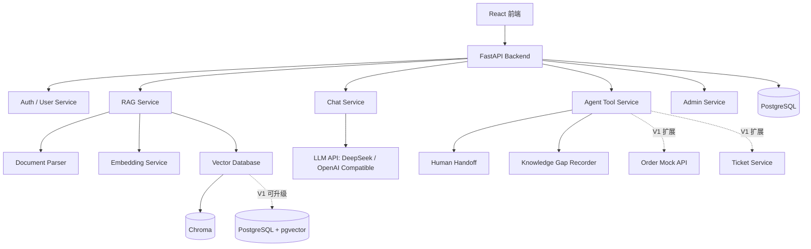

# 企业知识库 AI 客服 Agent 项目需求文档

> 项目英文名：**Enterprise Knowledge Base AI Agent**  
> GitHub 仓库建议名：`enterprise-knowledge-agent`  
> 项目定位：面向常见企业客服场景的通用 AI 客服 Agent Demo，基于 **React + FastAPI + DeepSeek API + Embedding + Chroma + 基础 RAG + 简单 Tool Calling** 实现；V1 增强版支持 **PostgreSQL + pgvector**。  
> 版本：v0.1  
> 作者：Dennis / peter-pan
> 目标：先完成一个基础、通用、可扩展的智能客服 Demo，重点打通“企业文档上传 -> RAG 检索问答 -> 引用来源 -> 无答案处理”的核心流程，后续再逐步增加企业集成功能。

---

## 1. 项目背景

很多企业已经有大量内部文档、售后政策、产品手册、FAQ、订单规则、合同模板、操作规范等资料，但这些资料通常分散在 PDF、Word、网页、Excel、企业微信文档或内部系统中。

传统客服机器人主要依赖固定问答或人工配置规则，问题包括：

1. 无法灵活理解用户自然语言问题。
2. 文档更新后，机器人知识不同步。
3. 回答没有引用来源，可信度不足。
4. 无法调用企业内部系统，例如订单、工单、库存、CRM。
5. 很难沉淀用户问题、反馈和知识缺口。

本项目目标是做一个最常见、最通用的企业智能客服 Agent Demo：  
用户可以在网页聊天窗口提问，系统优先通过 RAG 检索企业知识库文档，再调用大语言模型生成有依据的回答；当知识库无法回答时，系统可以记录知识缺口或提供转人工入口。项目不追求一开始做到完整企业级 SaaS，而是沉淀一套后续可迁移、可扩展的基础客服 Agent 架构。

---

## 2. 项目目标

### 2.1 项目定位原则

本项目遵循以下原则：

- RAG 是核心能力，必须实现，但只做最常见、基础、通用的版本。
- Demo 优先打通完整链路，而不是追求复杂算法或完整企业级能力。
- 系统设计要避免绑定具体行业，能够迁移到售后、产品问答、制度问答、内部知识助手等场景。
- 业务集成先预留扩展点，订单、工单、CRM、ERP 等能力可以后续通过 Tool Calling 扩展。
- 功能实现要能展示工程思路：模块清晰、配置可调、日志可查、后续可扩展。

### 2.2 基础 Demo 目标

完成一个可运行的通用企业智能客服 Agent Demo，支持：

- 网页聊天窗口
- 企业知识库文档管理
- PDF / TXT / Markdown 文档上传
- 文档解析与切片
- Embedding 向量化
- 向量数据库检索
- 基于基础 RAG 的问答
- 回答中显示引用来源
- 无依据时不编造，提示知识库未找到明确依据
- 无答案问题记录为知识缺口
- 简单用户反馈：有帮助 / 没帮助
- 管理后台查看文档、对话、反馈和知识缺口

### 2.3 V1 增强目标

在基础 Demo 跑通后，再逐步增强：

- 多知识库管理
- 多轮对话上下文
- 基础权限管理
- 人工客服转接入口
- Mock 工单创建
- Mock 订单状态查询
- 小型 RAG 评估集
- RAG 检索日志查看
- Docker 本地部署
- GitHub README、架构图、演示截图

### 2.4 长期扩展方向

如果后续真的用于企业项目，可以在当前基础上继续扩展：

- 多租户
- 企业微信 / 微信公众号 / 网站聊天窗口接入
- CRM / ERP / OA 系统集成
- 混合检索：关键词检索 + 向量检索
- Rerank 模型
- 文档版本管理
- 敏感信息脱敏
- 企业级审计日志
- 模型调用成本统计
- SaaS 化部署

---

## 3. 目标用户

### 3.1 外部客户

使用聊天窗口咨询产品、售后、退款、保修、物流、订单等问题。

### 3.2 企业客服人员

V1 增强角色。查看用户问题、AI 回复、用户反馈，并接管 AI 无法处理的问题。

### 3.3 企业知识库管理员

上传、更新、删除和管理企业文档，维护知识库内容。

### 3.4 企业管理者

查看文档数量、今日对话数、用户反馈数量、知识缺口数量和转人工请求数量。AI 解决率、用户满意率等指标作为 V1 增强能力。

---

## 4. 典型使用场景

### 场景一：售后政策问答

用户提问：

> 购买超过 30 天还能退款吗？

系统流程：

1. 接收用户问题。
2. 对问题做向量化。
3. 在知识库中检索相关售后政策。
4. 将检索结果作为上下文传给 LLM。
5. 生成回答。
6. 在回答中显示引用来源，例如《售后政策.pdf》第 3 页。
7. 保存对话记录。

### 场景二：产品使用说明问答

用户提问：

> 这款设备如何恢复出厂设置？

系统从产品说明书中检索对应片段，并生成步骤化回答。

### 场景三：知识库无法回答

用户提问：

> 我的订单为什么还没有发货？

基础 Demo 阶段，如果知识库没有相关答案，Agent 应该：

1. 明确说明知识库中未找到可靠依据。
2. 将问题记录为知识缺口，供管理员后续补充文档。
3. 提供转人工入口，让用户可以继续寻求人工客服帮助。

订单查询和工单创建不作为基础 Demo 必做能力，后续可以通过 Tool Calling + Mock API 模拟 `get_order_status` 和 `create_support_ticket`，真实企业项目中再替换为 ERP、CRM、OA 或客服工单系统接口。

### 场景四：知识缺口沉淀

用户多次问到知识库中没有的问题，例如：

> 你们是否支持海外配送？

系统应将该问题记录为知识缺口，供管理员后续补充文档。

---

## 5. 产品功能需求

### 5.1 用户端聊天模块

用户通过网页聊天界面向 AI 客服 Agent 提问，系统返回有依据的回答。

功能点：

- 文本输入
- 流式输出
- 多轮对话
- 引用来源展示
- 重新生成回答
- 用户反馈：有帮助 / 没帮助
- 人工客服转接入口
- 问题分类标签：售后、订单、产品、物流、其他

验收标准：

- 用户可以连续提问。
- AI 回复内容能够引用知识库来源。
- AI 不应在无依据时编造答案。
- 用户可以对回答进行反馈。
- 所有对话应保存到数据库。

---

### 5.2 知识库管理模块

管理员可以创建知识库，上传企业文档，并查看文档索引状态。

功能点：

- 创建知识库
- 编辑知识库名称和描述
- 上传文档
- 支持文件类型：PDF、TXT、Markdown、DOCX（V1 可选）、CSV / Excel（V2 可选）
- 文档解析
- 文本切片
- Embedding 向量化
- 向量入库
- 文档启用 / 禁用
- 删除文档
- 查看索引状态：待处理、处理中、已完成、失败

验收标准：

- 管理员能上传文档。
- 文档上传后能被解析、切片和向量化。
- 用户提问时能检索到该文档内容。
- 管理员能查看每个文档的处理状态。

---

### 5.3 RAG 检索问答模块

系统通过 RAG 将用户问题与企业知识库连接起来，降低幻觉，提高回答可信度。

本项目中的 RAG 模块是核心能力，但只要求实现最常见、最基础、最通用的企业知识库 RAG Pipeline。该 Pipeline 不与具体行业绑定，后续可以迁移到售后客服、内部知识助手、制度问答、产品文档问答、技术支持、培训资料问答等不同企业场景中。

RAG 模块的核心目标不是追求复杂算法，而是沉淀一套可复用、可配置、可扩展、能讲清楚工程流程的基础方案。

基础版只做以下能力：

- 文档解析
- 文本切片
- Embedding 向量化
- 向量数据库 Top-K 检索
- 检索结果注入 Prompt
- 基于知识库片段回答
- 引用来源展示
- 无依据拒答
- 基础检索日志

流程：

1. 文档接入：上传 PDF、TXT、Markdown 等企业资料。
2. 文档解析：提取正文内容，并尽量保留文档名、页码、章节标题等基础元数据。
3. 文本清洗：处理空行、明显乱码、重复空白和无意义字符。
4. 文本切片：基础版优先使用固定长度切片 + overlap，后续再扩展标题切片或递归切片。
5. 元数据入库：保存知识库 ID、文档 ID、文件名、页码、章节、上传时间、启用状态等信息。
6. 向量化：使用 Embedding Model 将文档片段转换为向量。
7. 索引入库：将 chunk 文本、embedding 和 metadata 写入向量数据库。
8. 检索召回：基于 Query Embedding 从向量数据库中召回 Top-K 相关片段。
9. Prompt 构建：将用户问题、检索片段、引用信息和回答约束组装为 Prompt。
10. LLM 回答：调用 DeepSeek / OpenAI 兼容 LLM API 生成回答。
11. 引用溯源：返回答案时展示来源文档、页码、章节或片段标题。
12. 拒答控制：当检索结果不足或相似度低于阈值时，明确说明知识库中未找到依据。
13. 日志记录：保存本次检索结果、分数、Prompt、模型输出和耗时。

基础策略：

- Top-K 默认值：5
- Chunk Size 默认值：500 - 800 tokens
- Chunk Overlap 默认值：80 - 120 tokens
- 检索阈值：可配置
- Embedding Model：可配置，基础版可以先选择一种模型，代码结构预留替换能力
- Vector Database：基础 Demo 默认使用 Chroma；V1 增强版支持 PostgreSQL + pgvector
- Prompt 模板：单独管理，便于针对不同业务场景复用
- 回答必须基于检索结果
- 无相关上下文时必须说明“知识库中未找到明确依据”
- 每个 chunk 必须保留可追溯 metadata，不能只保存纯文本

通用能力要求：

- 文档处理流程标准化：解析、清洗、切片、元数据提取、向量化、索引入库。
- 检索配置可调整：Top-K、相似度阈值、Chunk Size、Chunk Overlap、Embedding Model。
- 模型与基础设施可替换：LLM、Embedding Model、Vector Database 不应强绑定某一家供应商。
- 引用来源可追溯：回答中应能展示文档名、页码、章节或片段标题。
- 无依据可拒答：当知识库没有明确内容时，不应编造答案。
- 检索过程可观测：后台可以查看每次问答命中的 chunk、相似度分数、Prompt 和模型输出。
- 效果可以基础评估：支持构建小型 RAG 测试问题集，用来验证能否命中、引用是否正确、无答案是否拒答。
- 业务可迁移：RAG Pipeline 不直接依赖客服业务对象，订单查询、工单创建等应放在 Agent Tool Calling 模块中。
- 复杂能力后置：关键词检索、混合检索、Rerank、查询改写、多轮检索增强等能力作为后续扩展，不放入基础 Demo 必做范围。

验收标准：

- 对于知识库中存在的问题，AI 能基于文档回答。
- 回答应显示来源文档、页码或片段标题。
- 对于知识库中不存在的问题，AI 不应编造答案。
- 后台可以查看本次回答使用了哪些文档片段。
- 管理员可以看到每个检索片段的相似度分数和 metadata。
- 修改 Top-K、Chunk Size、检索阈值后，RAG 行为应能随配置变化。
- 至少准备一组 RAG 测试问题，覆盖“能回答”“不能回答”“引用是否正确”三类场景。
- RAG 模块应能在不修改核心流程的情况下，更换知识库内容用于其他业务场景。

---

### 5.4 Agent Tool Calling 模块

当用户问题不能仅靠知识库回答时，Agent 可以调用工具完成简单业务动作。

基础 Demo 阶段不追求复杂业务集成，只保留最通用的客服动作：检索知识库、记录知识缺口、转人工入口。订单查询、创建工单、CRM / ERP 集成等能力作为后续扩展。

基础 Demo 工具列表：

#### 1. `search_knowledge_base`

用途：检索企业知识库。

输入：

```json
{
  "query": "退款政策",
  "top_k": 5
}
```

输出：

```json
{
  "chunks": [
    {
      "document_name": "售后政策.pdf",
      "content": "购买后7天内支持无理由退款...",
      "score": 0.87
    }
  ]
}
```

#### 2. `record_knowledge_gap`

用途：记录知识库缺失的问题。

输入：

```json
{
  "question": "是否支持海外配送？",
  "conversation_id": "c_001"
}
```

输出：

```json
{
  "status": "recorded"
}
```

#### 3. `handoff_to_human`

用途：转人工客服。基础 Demo 可以先实现为“提交转人工请求 / 显示转人工提示”，不需要真实客服坐席系统。

输入：

```json
{
  "conversation_id": "c_001",
  "reason": "AI无法确认退款规则"
}
```

输出：

```json
{
  "handoff_status": "waiting",
  "message": "已为您转接人工客服"
}
```

后续扩展工具：

#### 4. `get_order_status`

用途：查询订单状态。增强阶段可以使用 Mock 数据，不需要真实对接企业 ERP。

输入：

```json
{
  "order_id": "202607070001"
}
```

输出：

```json
{
  "order_id": "202607070001",
  "status": "已发货",
  "tracking_number": "SF123456789",
  "estimated_delivery": "2026-07-09"
}
```

#### 5. `create_support_ticket`

用途：当 AI 无法解决问题时创建工单。

输入：

```json
{
  "user_id": "u_001",
  "question": "我的订单一直没有发货",
  "summary": "用户咨询订单未发货原因",
  "priority": "normal"
}
```

输出：

```json
{
  "ticket_id": "T202607070001",
  "status": "created"
}
```

验收标准：

- Agent 能判断什么时候需要调用工具。
- 工具调用记录应保存。
- 工具调用结果应参与最终回答。
- 用户应能看到自然语言结果，而不是 JSON。
- 基础 Demo 至少实现知识缺口记录和转人工入口。
- 订单查询、工单创建作为增强能力，不作为基础 Demo 必须完成项。

---

### 5.5 管理后台模块

管理员通过后台管理知识库、对话、反馈和系统设置。

页面列表：

1. Dashboard：文档数量、今日对话数、用户反馈数量、知识缺口数量、转人工请求数量。
2. 知识库管理：知识库列表、文档列表、文档处理状态、最近更新时间。
3. 对话记录：用户问题、AI 回答、引用来源、工具调用记录、用户反馈。
4. 知识缺口：AI 无法回答的问题、高频未解决问题、管理员处理状态。
5. 系统设置：LLM Provider、API Key 配置、Top-K、Chunk Size、温度参数、最大输出长度。

V1 增强指标：

- AI 解决率
- 用户满意率
- Token 消耗统计
- 模型调用成本

---

### 5.6 权限模块

基础 Demo 角色：

- 普通用户：使用聊天、查看自己的历史对话。
- 管理员：上传和管理文档、查看对话、查看反馈、查看知识缺口。

V1 增强角色：

- 客服人员：查看对话、接管人工客服、关闭工单。

验收标准：

- 不同角色看到不同菜单。
- 普通用户不能上传知识库文档。
- 管理员可以管理文档、查看对话、反馈和知识缺口。

---

## 6. 非功能性需求

### 6.1 性能

- 普通问答首字响应时间：建议 < 3 秒
- 完整回答时间：建议 < 15 秒
- 向量检索时间：建议 < 2 秒
- 支持并发：MVP 支持 10 - 50 并发即可

### 6.2 安全

- API Key 不允许写死在前端代码中
- API Key 存储在后端环境变量中
- 登录接口需要认证
- 管理后台需要权限控制
- 文档数据与用户对话需要持久化保存
- 敏感日志不应输出完整 API Key

### 6.3 可维护性

- 前后端分离
- 代码模块清晰
- Prompt 单独管理
- Tool 定义单独管理
- RAG Pipeline 单独管理
- README 包含安装和启动说明

### 6.4 可观测性

- 记录每次 LLM 调用
- 记录 Token 消耗
- 记录检索到的文档片段
- 记录工具调用
- 记录错误日志

---

## 7. 技术架构

### 7.1 总体架构



### 7.2 推荐技术栈

前端：

- React
- TypeScript
- Vite
- Ant Design / shadcn/ui
- Axios / Fetch
- SSE 或 WebSocket 流式输出

后端：

- FastAPI
- Python
- Pydantic
- SQLAlchemy
- Uvicorn
- JWT Auth

AI / RAG：

- DeepSeek API：作为主要 LLM
- OpenAI-compatible API Client
- Embedding Model：BGE-M3 / Qwen Embedding / OpenAI Embedding
- Vector Database：基础 Demo 默认使用 Chroma，便于快速跑通；V1 增强版支持 PostgreSQL + pgvector

数据库：

- PostgreSQL：基础业务数据存储；V1 可配合 pgvector 承载向量检索
- Redis（V1 可选，用于缓存和任务队列）

部署：

- Docker
- Docker Compose
- Nginx（V1 可选）

---

## 8. 数据库设计

### 8.1 users

| 字段 | 类型 | 说明 |
|---|---|---|
| id | UUID | 用户ID |
| username | varchar | 用户名 |
| email | varchar | 邮箱 |
| password_hash | varchar | 密码哈希 |
| role | varchar | user / support / admin |
| created_at | datetime | 创建时间 |

### 8.2 knowledge_bases

| 字段 | 类型 | 说明 |
|---|---|---|
| id | UUID | 知识库ID |
| name | varchar | 知识库名称 |
| description | text | 描述 |
| owner_id | UUID | 创建人 |
| created_at | datetime | 创建时间 |

### 8.3 documents

| 字段 | 类型 | 说明 |
|---|---|---|
| id | UUID | 文档ID |
| kb_id | UUID | 知识库ID |
| filename | varchar | 文件名 |
| file_type | varchar | 文件类型 |
| status | varchar | pending / processing / indexed / failed |
| content_hash | varchar | 文件哈希 |
| created_at | datetime | 上传时间 |

### 8.4 document_chunks

| 字段 | 类型 | 说明 |
|---|---|---|
| id | UUID | 片段ID |
| document_id | UUID | 文档ID |
| kb_id | UUID | 知识库ID |
| chunk_text | text | 文本片段 |
| embedding | vector | 向量 |
| page_number | integer | 页码 |
| metadata | jsonb | 元数据 |
| created_at | datetime | 创建时间 |

### 8.5 conversations

| 字段 | 类型 | 说明 |
|---|---|---|
| id | UUID | 会话ID |
| user_id | UUID | 用户ID |
| title | varchar | 会话标题 |
| status | varchar | active / closed / handoff |
| created_at | datetime | 创建时间 |

### 8.6 messages

| 字段 | 类型 | 说明 |
|---|---|---|
| id | UUID | 消息ID |
| conversation_id | UUID | 会话ID |
| role | varchar | user / assistant / system / tool |
| content | text | 消息内容 |
| citations | jsonb | 引用来源 |
| created_at | datetime | 创建时间 |

### 8.7 tool_calls

| 字段 | 类型 | 说明 |
|---|---|---|
| id | UUID | 工具调用ID |
| conversation_id | UUID | 会话ID |
| tool_name | varchar | 工具名称 |
| input | jsonb | 输入参数 |
| output | jsonb | 输出结果 |
| status | varchar | success / failed |
| created_at | datetime | 创建时间 |

### 8.8 feedback

| 字段 | 类型 | 说明 |
|---|---|---|
| id | UUID | 反馈ID |
| message_id | UUID | 消息ID |
| rating | varchar | helpful / not_helpful |
| comment | text | 备注 |
| created_at | datetime | 创建时间 |

### 8.9 knowledge_gaps

| 字段 | 类型 | 说明 |
|---|---|---|
| id | UUID | 知识缺口ID |
| question | text | 用户问题 |
| conversation_id | UUID | 来源会话 |
| status | varchar | open / resolved |
| created_at | datetime | 创建时间 |

---

## 9. API 设计

### 9.1 Auth

```http
POST /api/auth/login
POST /api/auth/register
GET /api/auth/me
```

### 9.2 Knowledge Base

```http
POST /api/knowledge-bases
GET /api/knowledge-bases
GET /api/knowledge-bases/{kb_id}
PUT /api/knowledge-bases/{kb_id}
DELETE /api/knowledge-bases/{kb_id}
```

### 9.3 Document

```http
POST /api/knowledge-bases/{kb_id}/documents
GET /api/knowledge-bases/{kb_id}/documents
GET /api/documents/{document_id}
DELETE /api/documents/{document_id}
POST /api/documents/{document_id}/reindex
```

### 9.4 Chat

```http
POST /api/chat
POST /api/chat/stream
GET /api/conversations
GET /api/conversations/{conversation_id}
DELETE /api/conversations/{conversation_id}
```

### 9.5 Feedback

```http
POST /api/messages/{message_id}/feedback
GET /api/admin/feedback
```

### 9.6 Admin

```http
GET /api/admin/dashboard
GET /api/admin/tool-calls
GET /api/admin/knowledge-gaps
PUT /api/admin/knowledge-gaps/{gap_id}
```

---

## 10. Prompt 设计要求

### 10.1 系统 Prompt

```text
你是企业知识库 AI 客服 Agent。你必须基于提供的知识库上下文回答用户问题。

规则：
1. 优先使用知识库内容回答。
2. 如果知识库中没有明确依据，不要编造答案。
3. 回答要清晰、简洁、专业。
4. 如果涉及政策、价格、退款、保修等敏感问题，必须引用来源。
5. 基础 Demo 阶段，如果知识库无法回答，可以记录知识缺口或提供转人工入口。
6. 订单查询、创建工单等业务工具属于 V1 扩展能力，不要在基础 Demo 中假装已经接入。
7. 回答最后列出引用来源。
```

### 10.2 RAG Prompt 模板

```text
用户问题：
{question}

检索到的知识库内容：
{retrieved_context}

请根据以上内容回答用户问题。

要求：
- 只使用知识库内容中的事实。
- 如果内容不足，请说明“知识库中未找到明确依据”。
- 回答后列出引用来源。
```

---

## 11. 前端页面设计

### 11.1 登录页

- 邮箱
- 密码
- 登录按钮
- 注册入口

### 11.2 用户聊天页

左侧：

- 会话列表
- 新建会话

右侧：

- 聊天消息
- 输入框
- 引用来源卡片
- 反馈按钮
- 转人工按钮

### 11.3 管理后台 Dashboard

- 文档数量
- 今日对话数
- 用户反馈数量
- 知识缺口数量
- 转人工请求数量

### 11.4 知识库管理页

- 知识库列表
- 创建知识库
- 上传文档
- 文档状态
- 删除文档
- 重新索引

### 11.5 对话记录页

- 用户问题
- AI回答
- 引用来源
- 工具调用
- 用户反馈

### 11.6 知识缺口页

- 缺口问题列表
- 状态管理
- 补充知识入口

---

## 12. 六阶段开发规划

### 阶段 1：基础聊天闭环

目标：先让系统能跑。

做：

- React 聊天界面
- FastAPI 后端
- DeepSeek API / OpenAI-compatible LLM 调用
- 流式输出

验收：

- 用户输入问题后，后端调用 DeepSeek 或本地演示回复。
- 前端能显示 AI 回复。
- 不做 RAG、权限和后台。

### 阶段 2：知识库上传与文档解析

目标：让企业文档能进入系统。

做：

- 上传 PDF / TXT / Markdown
- 文档列表
- 文档状态
- 文本解析
- 简单文本清洗

验收：

- 上传一个售后政策 PDF 后，系统能解析出文本。
- 后台或知识库页面能看到文档和处理状态。

### 阶段 3：RAG 核心闭环

目标：完成项目最重要的核心价值。

做：

- 文本切片
- Embedding
- Chroma 向量入库
- Top-K 检索
- Prompt 拼接
- 基于知识库回答
- 引用来源
- 无依据拒答
- 基础 RAG 日志

验收：

- 上传售后政策后，用户问退款问题，系统能检索相关片段并基于片段回答。
- 回答显示来源。
- 没有依据时不编造。

### 阶段 4：客服基础功能

目标：让系统更像真实客服系统。

做：

- 聊天记录
- 历史会话
- 用户反馈
- 知识缺口记录
- 转人工入口

验收：

- 用户问知识库没有的问题时，系统不胡说。
- 问题能记录到知识缺口。
- 系统提示可以转人工。

### 阶段 5：管理后台

目标：让企业能管理这个系统。

做：

- Dashboard
- 知识库管理
- 文档管理
- 对话记录
- 反馈记录
- 知识缺口列表
- RAG 检索日志

验收：

- 管理员能看到文档数量、对话记录、AI 使用的知识片段、用户反馈和未解决问题。

### 阶段 6：Tool Calling / 企业系统模拟

目标：展示 Agent 能接企业系统。

做：

- 订单查询 Mock API
- 创建工单 Mock API
- 工具调用记录
- 自然语言结果返回

验收：

- 用户问“我的订单 10001 到哪了？”时，Agent 调用 `get_order_status`。
- 系统返回自然语言结果，例如“订单已发货，预计明天送达”。
- 面试时可以说明：当前版本用 Mock API 模拟订单系统，真实企业中可替换为 ERP、CRM、OA 或工单系统接口。

### 节奏建议

| 阶段 | 时间 | 结果 |
|---|---:|---|
| 阶段 1 | 1-2 天 | AI 聊天能跑 |
| 阶段 2 | 2-3 天 | 文档能上传解析 |
| 阶段 3 | 4-7 天 | RAG 问答核心完成 |
| 阶段 4 | 2-4 天 | 客服功能完善 |
| 阶段 5 | 3-5 天 | 管理后台可展示 |
| 阶段 6 | 3-5 天 | Agent 工具调用演示 |

正常节奏：3-4 周可以做出不错的 Demo。继续打磨 README、截图、Docker、测试问题集后，4-6 周可以变成可投简历的作品。

---

## 13. 项目目录建议

```text
enterprise-knowledge-agent/
├── frontend/
│   ├── src/
│   ├── package.json
│   └── vite.config.ts
│
├── backend/
│   ├── app/
│   │   ├── api/
│   │   ├── core/
│   │   ├── models/
│   │   ├── schemas/
│   │   ├── services/
│   │   │   ├── rag_service.py
│   │   │   ├── llm_service.py
│   │   │   ├── embedding_service.py
│   │   │   ├── agent_service.py
│   │   │   └── document_service.py
│   │   ├── tools/
│   │   └── main.py
│   ├── requirements.txt
│   └── .env.example
│
├── docker-compose.yml
├── README.md
└── docs/
    ├── requirement.md
    ├── architecture.md
    └── screenshots/
```

---

## 14. 面试展示重点

这个项目完成后，面试可以这样介绍：

> 我做了一个通用企业知识库 AI 客服 Agent Demo，技术栈是 React、FastAPI、DeepSeek API、Embedding、Chroma、RAG 和简单 Tool Calling。系统支持企业文档上传、向量化索引、基于知识库的问答、引用来源展示、无依据拒答、聊天记录保存、用户反馈、知识缺口记录和转人工入口。后续可以通过 Mock API 模拟订单查询和工单创建，并在真实企业项目中替换为 ERP、CRM、OA 或客服工单系统接口。

---

## 15. 简历写法

### 项目名称

企业知识库 AI 客服 Agent  
Enterprise Knowledge Base AI Agent

### 技术栈

React、FastAPI、DeepSeek API、Embedding、Chroma、RAG、Agent Tool Calling、PostgreSQL、pgvector

### 项目描述

独立开发通用企业知识库 AI 客服 Agent Demo，基于 RAG 检索增强生成技术，实现企业文档上传、知识库向量化、智能问答、引用来源展示、无依据拒答、知识缺口记录和简单 Agent Tool Calling 能力，用于模拟企业客服、售后和内部知识助手场景。

### 个人职责

- 设计前后端分离系统架构。
- 开发 React 用户聊天界面和管理后台。
- 使用 FastAPI 实现后端接口、文档管理和聊天服务。
- 实现文档解析、文本切片、Embedding 和向量数据库检索。
- 集成 DeepSeek / OpenAI Compatible LLM API。
- 设计 RAG Prompt，控制回答基于知识库并显示引用来源。
- 实现简单 Agent Tool Calling，支持知识缺口记录和转人工入口，并预留订单查询、创建工单等企业系统集成扩展。
- 设计聊天记录、用户反馈、知识缺口等数据结构。

---

## 16. 参考资料

- React 官方文档：https://react.dev/
- FastAPI WebSocket 官方文档：https://fastapi.tiangolo.com/advanced/websockets/
- AWS RAG 介绍：https://aws.amazon.com/what-is/retrieval-augmented-generation/
- pgvector GitHub：https://github.com/pgvector/pgvector
- DeepSeek API 文档：https://api-docs.deepseek.com/
- OpenAI Tool Calling 文档：https://developers.openai.com/api/docs/guides/function-calling
- GitHub 参考项目：OpenAgent：https://github.com/the-open-agent/openagent
- GitHub 参考项目：RAG Knowledge Base Chatbot：https://github.com/OptyxStack/rag-knowledge-base-chatbot

---

## 17. 当前优先级建议

第一阶段不要一开始就做完整企业版，先按下面顺序推进：

1. React + FastAPI + DeepSeek 基础聊天
2. 文档上传
3. 文档切片
4. 向量检索
5. RAG 回答
6. 引用来源
7. 聊天记录
8. Tool Calling
9. 管理后台
10. Docker 部署

优先做出一个能跑、能演示、能讲清楚架构的版本，再逐步打磨成熟度。
